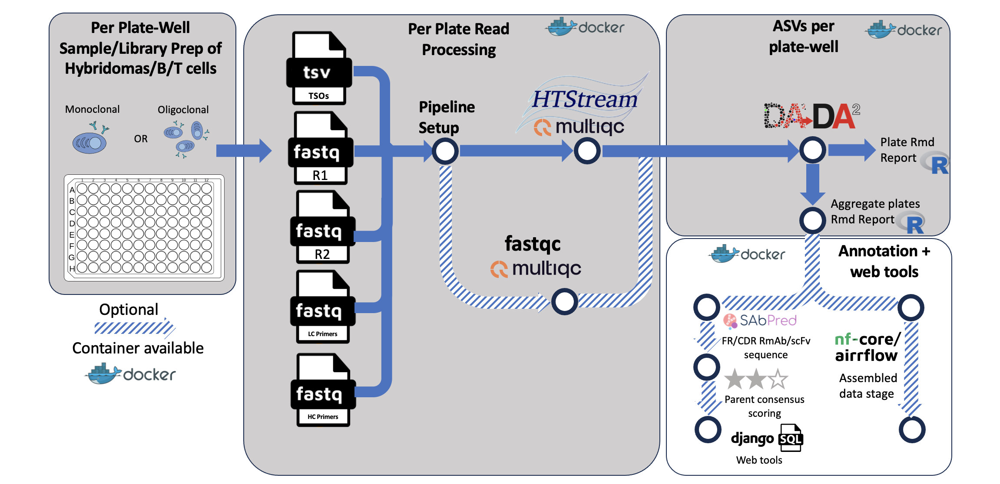

#  

[](https://doi.org/10.5281/zenodo.00000000)
[](https://github.com/nf-core/clonalvdjseq/actions?query=workflow%3A%22nf-core+linting%22)
[](https://www.nextflow.io/)
[](https://docs.conda.io/en/latest/)
[](https://www.docker.com/)
[](https://tower.nf/launch?pipeline=https://github.com/nf-core/clonalvdjseq)
[](https://nfcore.slack.com/channels/clonalvdjseq)


## Pipeline Summary

**ClonalVDJSeq** orchestrates a series of bioinformatics tools to process high-throughput sequencing data for clonal libraries. The pipeline is structured as follows:



1. **Setup Pipeline**: Initializes the analysis environment for each sample plate. This includes setting up directories, preparing raw data, and copying necessary primer and script files. This setup ensures that each plate's data is ready for subsequent processing steps.
  
2. **Run HTStream**: Processes raw sequencing reads to perform quality control and primer trimming. This step involves several sub-steps:
   - **Quality Control**: Utilizes HTStream's `hts_QWindowTrim` to apply quality trimming, ensuring only high-quality bases are retained.
   - **Primer Trimming**: Uses `hts_Primers` to trim sequencing adapters and primers, reducing potential artifacts in downstream analyses.
   - **Sequence Screening**: Employs `hts_SeqScreener` to remove unwanted sequences such as vectors or contaminants that could interfere with variant identification.
   - **Read Merging**: Combines paired-end reads with `hts_Overlapper`, crucial for reconstructing complete antibody sequences.
   - **Length Filtering**: Applies `hts_LengthFilter` to discard reads that do not meet the length requirements, focusing analysis on sequences of interest.

3. **DADA2 Analysis**: Executes the DADA2 pipeline to identify and quantify sequence variants, broken down into detailed steps:
   - **Error Rate Learning**: Estimates error rates from the sequencing data, which is critical for accurately modeling and correcting sequencing errors during variant inference.
   - **Dereplication**: Collapses reads into unique sequences, reducing computational complexity and improving processing efficiency.
   - **Sample Inference**: Runs the core DADA2 algorithm to infer the sample composition by distinguishing between real biological variants and sequencing errors.
   - **Merge Pairs**: Combines forward and reverse reads to reconstruct the full-length variants, crucial for antibody sequencing.
   - **Remove Chimeras**: Identifies and removes chimeric sequences that can result from PCR artifacts, ensuring the purity of variant data.
   - **Assign Taxonomy** (optional): Annotates sequences based on known databases, providing preliminary insights into the potential functionality and characteristics of the antibodies.

4. **Aggregate Results and Generate Reports**: Compiles results from all processed plates and generates comprehensive analysis reports using R Markdown. This final step provides a summarized view of the findings, allowing for easy interpretation and further research or development activities.


5. **Populate Database and Annotation**: Integrates the processed data into a database for storage and retrieval, enabling easy access to the results for future analyses. This step also annotates the sequences with additional information, such as germline gene usage, CDR/FR regions, and confidence scoring across clonal groupings. 

6. **Running Django Server**: Launches a Django server to provide a user-friendly interface for exploring the processed data, including interactive visualizations and search capabilities. This web-based interface allows users to query the database, visualize the results, and download the processed data for further analysis.


Each of these steps is designed to be modular, allowing for customization and scalability depending on the project requirements and the complexity of the sample sets.


## Usage

```bash
nextflow run nf-core/clonalvdjseq --input 'samplesheet.tsv' --outdir <output_directory> -profile <docker/singularity/conda>
```

### Options:
   --samplesheet      Path to the samplesheet file.
   --outdir           The output directory for results.
   --htstreamOverwrite  Overwrite existing files during HTStream processing [true/false].
   --dada2Overwrite   Overwrite existing files during DADA2 analysis [true/false].
   --baseDir          Base directory for processing and output.
   --rawDataDir       Directory containing raw sequencing data.
   --nmseqDir         Directory containing scripts and resources needed.
   --hcPrimers        Path to file containing heavy chain primers.
   --lcPrimers        Path to file containing light chain primers.
   --help             Print this help message and exit.

### Sample Sheet Format
```
filePrefix	plate	submissionID	Primers	SeqYear	SeqMonth	SeqDay
TRIMMER_Plate79_S1	TRIMMER0090_P79	59abfa14c2d3	TSO_demux_primers.csv	2022	6	3
TRIMMER_Plate80_S2	TRIMMER0091_P80	c90a3466b251	TSO_demux_primers.csv	2022	6	3
TRIMMER_Plate81_S3	TRIMMER0092_P81	de5825783414	TSO_demux_primers.csv	2022	6	3
TRIMMER_Plate82_S4	TRIMMER0093_P82	d007826dd8d8	TSO_demux_primers.csv	2022	6	3
TRIMMER_Plate83_S5	TRIMMER0094_P83	53fda6d320bc	TSO_demux_primers.csv	2022	6	3
TRIMMER_Plate84_S6	TRIMMER0095_P84	988c5850876e	TSO_demux_primers.csv	2022	6	3
TRIMMER_Plate85_S7	TRIMMER0096_P85	ebe392c6caed	TSO_demux_primers.csv	2022	6	3
TRIMMER_Plate86_S8	TRIMMER0097_P86	a8606aabb6de	TSO_demux_primers.csv	2022	6	3
TRIMMER_Plate87_S9	TRIMMER0098_P87	af5a6586b4bf	TSO_demux_primers.csv	2022	6	3
TRIMMER_Plate88_S10	TRIMMER0099_P88	f6e0a670c6cf	TSO_demux_primers.csv	2022	6	3
```


### Default SMART-Index Layout
- See full defaault file in `resources/SMARTindex_well.csv`
```
"index_name"	"well"
"01-SMARTindex"	"A1"
"02-SMARTindex"	"B1"
"03-SMARTindex"	"C1"
"04-SMARTindex"	"D1"
"05-SMARTindex"	"E1"
"06-SMARTindex"	"F1"
"07-SMARTindex"	"G1"
"08-SMARTindex"	"H1"
"09-SMARTindex"	"A2"
...
```

### Default SMART-Index Barcodes
- See full defaault file in `resources/TSO_demux_primers.csv`
```
SampleID	Target_Primer	Primer1ID	TSOBarcode	Primer2ID	TargetSpecificPrimers
01-SMARTindex_LCprimers	LC_primers	01-SMARTindex	CAGCGTCAGTGGTATCAACGCAGAGTACATGGGG	LC_primers	lc_primers.fasta
02-SMARTindex_LCprimers	LC_primers	02-SMARTindex	GATCACCAGTGGTATCAACGCAGAGTACATGGGG	LC_primers	lc_primers.fasta
03-SMARTindex_LCprimers	LC_primers	03-SMARTindex	ACCAGTCAGTGGTATCAACGCAGAGTACATGGGG	LC_primers	lc_primers.fasta
04-SMARTindex_LCprimers	LC_primers	04-SMARTindex	TGCACGCAGTGGTATCAACGCAGAGTACATGGGG	LC_primers	lc_primers.fasta
05-SMARTindex_LCprimers	LC_primers	05-SMARTindex	ACATTACAGTGGTATCAACGCAGAGTACATGGGG	LC_primers	lc_primers.fasta
06-SMARTindex_LCprimers	LC_primers	06-SMARTindex	GTGTAGCAGTGGTATCAACGCAGAGTACATGGGG	LC_primers	lc_primers.fasta
07-SMARTindex_LCprimers	LC_primers	07-SMARTindex	CTAGTCCAGTGGTATCAACGCAGAGTACATGGGG	LC_primers	lc_primers.fasta
08-SMARTindex_LCprimers	LC_primers	08-SMARTindex	TGTGCACAGTGGTATCAACGCAGAGTACATGGGG	LC_primers	lc_primers.fasta
09-SMARTindex_LCprimers	LC_primers	09-SMARTindex	TCAGGAACAGTGGTATCAACGCAGAGTACATGGGG	LC_primers	lc_primers.fasta
...
```


## Credits

ClonalVDJSeq was developed in collaboration with several key institutions and contributors who provided invaluable expertise and resources:

- **UC Davis Bioinformatics Core**: Provided essential bioinformatics support and infrastructure that facilitated the development and optimization of this pipeline. [UC Davis Bioinformatics Core](http://bioinformatics.ucdavis.edu)
- **Trimmer Lab**: Contributed critical insights, resources, and samples for antibody sequencing and analysis, significantly shaping the pipeline's capabilities in handling complex antibody libraries. [Trimmer Lab](https://trimmer.faculty.ucdavis.edu/)
- **UC Davis Sequencing Core**: Offered high-throughput sequencing services and scientific and technical support, ensuring high-quality sequencing data for pipeline testing and validation. [DNA Technologies and Expression Analysis Core](http://dnatech.genomecenter.ucdavis.edu)

### Key Publications:
- **NeuroMabSeq** was detailed in a publication in *Nature Scientific Reports*, which outlines the methodology and validation of the sequencing platform used for this pipeline. [High-volume hybridoma sequencing on the NeuroMabSeq platform enables efficient generation of recombinant monoclonal antibodies and scFvs for neuroscience research](https://www.nature.com/articles/s41598-023-43233-4).

### Individual Contributors:
- **Keith Mitchell** (GitHub: [@keithgmitchell](https://github.com/keithgmitchell)): Lead developer, responsible for the initial conception, design, and implementation of the ClonalVDJSeq pipeline. Keith's expertise in bioinformatics has been crucial in addressing the technical challenges associated with antibody sequencing.
- **Sam Hunter** (GitHub: [@samhunter](https://github.com/samhunter)): Played a pivotal role in refining the pipeline’s analytical algorithms and enhancing its usability and efficiency.
- **Matt Settles** (GitHub: [@msettles](https://github.com/msettles)): Contributed to the overall strategy and provided oversight, ensuring the pipeline meets the high standards required for academic and clinical research.


The collaboration between these teams and individuals has resulted in a robust pipeline that serves the needs of the scientific community, advancing research in antibody genomics and therapeutics.


## Citations

If you use ClonalVDJSeq for your analysis, please cite it using the following Zenodo DOI: [10.5281/zenodo.0000000](https://doi.org/10.5281/zenodo.0000000)

An extensive list of references for the tools used by the pipeline can be found in the [`CITATIONS.md`](CITATIONS.md) file.

You can cite the related publication as follows:

> **High-volume hybridoma sequencing on the NeuroMabSeq platform enables efficient generation of recombinant monoclonal antibodies and scFvs for neuroscience research.**
> _Nature Scientific Reports._ 2023. doi: [https://doi.org/10.1038/s41598-023-43233-4](https://doi.org/10.1038/s41598-023-43233-4).


### TODOS for Bradley?: also notes to self
- Test install instructions on a fresh machine
- Test running the pipeline on a small dataset
- See if we can make things work for not full plates? This might be a future feature request
- See what other parameters we can add to the pipeline 
  - Easy: (checking to see if things are already done instead of overwriting them) (mostly just for the runHTStream rule)
- Hard coded paths in the pipeline
- AddGene scripts?
- remove submission ID fully, using spreadsheet for that
- make sure the reporting files in there for example outputs
- add conda envs
- compare with files on cluster just to be sure
- 